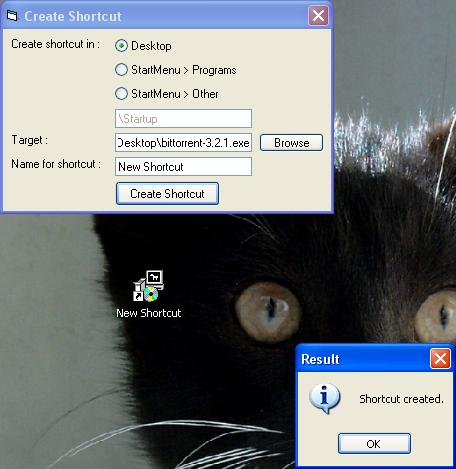



## \_Create Shortcut\_

### Description

This simple program creates a shortcut. Well commented.
 
### More Info
 

             |
---                |---
**Submitted On**   |2003-09-19 17:59:24
**By**             |[BelgiumBoy\_007](https://github.com/Planet-Source-Code/PSCIndex/blob/master/ByAuthor/belgiumboy-007.md)
**Level**          |Advanced
**User Rating**    |4.2 (21 globes from 5 users)
**Compatibility**  |VB 6\.0
**Category**       |[Windows API Call/ Explanation](https://github.com/Planet-Source-Code/PSCIndex/blob/master/ByCategory/windows-api-call-explanation__1-39.md)
**World**          |[Visual Basic](https://github.com/Planet-Source-Code/PSCIndex/blob/master/ByWorld/visual-basic.md)
**Archive File**   |[\_Create\_Sh1648749222003\.zip](https://github.com/Planet-Source-Code/belgiumboy-007-create-shortcut__1-48703/archive/master.zip)

